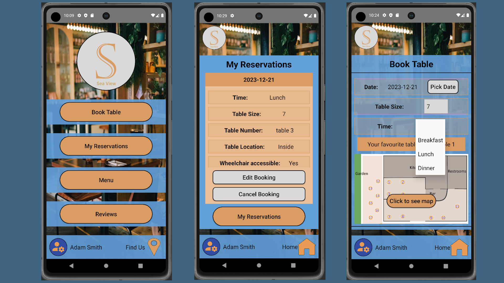

# Sea View Android App

#### COMP 2000 - Assignment 2 - Coursework

This project was part of my secound-year coursework, module COMP2000. It’s an android application for a resteraunt (Sea View). 

A product vision and functional requirements were given and can be found in the appendix.

An API provided by the uni was to be used to store the booking details and is specified in the API Section.


## Credits


- **Background Image**
  - *Author:* Leeloo Thefirst
  - *Source:* [Link to Image](https://www.pexels.com/photo/brown-wooden-table-with-empty-glasses-and-plates-in-a-cafe-4676640/)

- **Burger Image**
  - *Author:* Valeria Boltneva
  - *Source:* [Link to Image](https://www.pexels.com/photo/burger-with-fried-fries-on-black-plate-with-sauce-on-the-side-1199957/)

- **Lamb Image**
  - *Author:* Chevanon Photography
  - *Source:* [Link to Image](https://www.pexels.com/photo/close-up-of-steak-meal-served-in-plate-323682/)

- **Pasta Image**
  - *Author:* Lisa Fotios
  - *Source:* [Link to Image](https://www.pexels.com/photo/selective-focus-photography-of-pasta-with-tomato-and-basil-1279330/)

- **Pancakes Image**
  - *Author:* Ash
  - *Source:* [Link to Image](https://www.pexels.com/photo/pancake-with-sliced-strawberry-376464/)

 
- **Volley Library**
  - Copyright 2011 The Android Open Source Project
  - Licensed under the Apache License, Version 2.0 ([License](https://github.com/google/volley/blob/67f7639b182b07deca07771bf98cf66b216baa12/LICENSE))
  - *Source:* [Github](https://github.com/google/volley.git)

## API Reference

#### URL

```http
  https://web.socem.plymouth.ac.uk/COMP2000/ReservationApi/api/Reservations
```


## Appendix

#### Product Vision
A big restaurant that is near the sea wants to develop a mobile application to enable a booking
facility for customers through a mobile phone. The reservation could be for breakfast, lunch or
dinner. The restaurant has an inside and outside seating area, and the maximum table size is 10
people. Also, it’s busy, so the reservation should be a week in advance. The app is to enable
customers make and manage their booking (i.e. view and edit the booking’s details). Customers
could choose where to sit (inside or outside, seaside or garden side). Customers could cancel
their booking 24 hours in advance. The app is supposed to push notifications to inform users,
when a booking approved/declined, and also to inform of any update regarding the booking (e.g.
when bookings get updated/ cancelled). Users need to login to their account in order to
perform the functionalities. Users should be able to turn notifications on/off when needed. Users
can manage preferences in their account (e.g. set their favourite meals or location within the
restaurant).

#### The customer side: Functional Requirements
- As a customer I wish to view the available tables.
- As a customer I wish to make a booking (specific time, date, mealtime, table’s size and seating area (inside or outside).
- As a customer I wish to manage my booking (edit/cancel).
- As a customer I wish to add a review
- As a customer I wish to view my previous bookings (history).


